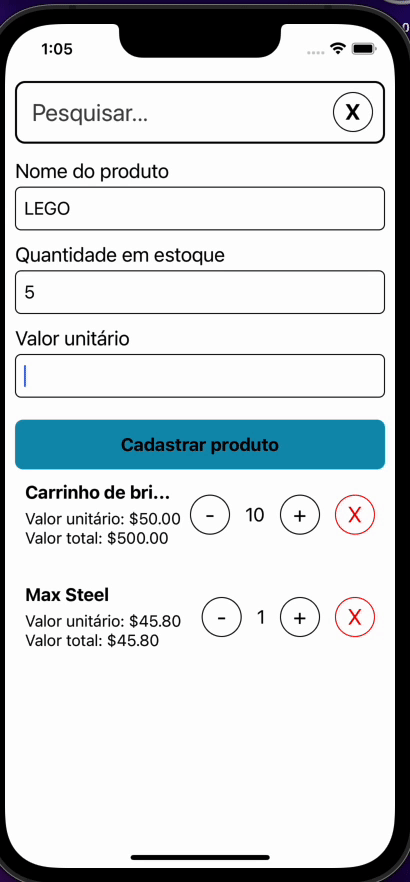

# Backoffice App

[](https://github.com/mechamobau/BackofficeApp/actions/workflows/ci.yml)
[](https://coveralls.io/github/mechamobau/BackofficeApp)
[](https://codeclimate.com/github/mechamobau/BackofficeApp/maintainability)

Aplicativo feito em React Native utilizado para armazenar uma lista:

- Filtrável
- Armazenada em memória
- Reativa
- Dark mode



## Building

Para executar o projeto basta executar:

```bash
yarn     # Instalar as dependências
```

E executar em sua plataforma escolhida para testar:

```bash
yarn ios     # iOS
yarn android # OU android
```
